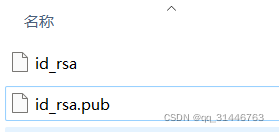

## 设置 Git 用户签名，执行以下命令

`git config --global user.name 用户名` 
`git config --global user.email 邮箱`

执行之后打开 C 盘 User 目录，会看到 Git 的配置文件.gitconfig

## 接下来，进行公钥以及私钥的生成

1.在 C 盘 User 目录下，右键 Git Bash Here
执行以下命令： 
`ssh-keygen -t rsa -C "邮箱号"` 与上边邮箱一样 
连续点击三次回车

2.再次来到 C 盘 User 目录
看到生成了.ssh 文件，打开，可以看到生成了公钥以及私钥。 

 

直接点击查看，或者命令行方式打开查看均可。

3.复制公钥，移步 github，进行设置
打开，Settings-->SSH and GPG keys
